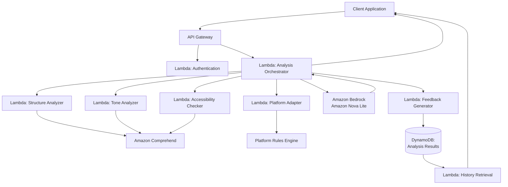

# Design Document: AI-Powered Content Quality Reviewer

## Overview

The AI-powered Content Quality Reviewer is a serverless system built on AWS that analyzes digital content across multiple quality dimensions and provides actionable feedback to student creators. The system leverages AWS managed services including Lambda, Comprehend, and API Gateway to deliver scalable, cost-effective content analysis without requiring server management.

The system follows a microservices architecture where each quality dimension is analyzed by specialized components, enabling independent scaling and maintenance. The design emphasizes explainability, responsible AI use, and preservation of the creator's original voice while providing constructive feedback.

## Architecture

The system uses a serverless, event-driven architecture built on AWS services:



**Key Architectural Principles:**
- **Serverless-first**: All compute runs on AWS Lambda for automatic scaling and cost optimization
- **Event-driven**: Components communicate through events and API calls
- **Separation of concerns**: Each analyzer handles a specific quality dimension
- **Managed services**: Leverages AWS Comprehend for NLP capabilities
- **Stateless design**: Each request is independent, enabling horizontal scaling

## Components and Interfaces

### Lambda Function Specifications

**Runtime**: Node.js 20.x
**Memory**: 1024 MB (adjustable per function)
**Timeout**: 30 seconds
**Environment Variables**:
```
BEDROCK_MODEL_ID=us.amazon.nova-lite-v1:0
DYNAMODB_TABLE_NAME=ContentAnalysisResults
COMPREHEND_REGION=us-east-1
API_KEY_SECRET_NAME=content-reviewer/api-keys
MAX_CONTENT_LENGTH=2000
ANALYSIS_TIMEOUT_MS=25000
```

**IAM Permissions Required**:
- `bedrock:InvokeModel` - For AI analysis
- `comprehend:DetectSentiment` - For sentiment analysis
- `comprehend:DetectKeyPhrases` - For key phrase extraction
- `comprehend:DetectSyntax` - For syntax analysis
- `dynamodb:PutItem` - For storing results
- `dynamodb:GetItem` - For retrieving results
- `dynamodb:Query` - For history queries
- `secretsmanager:GetSecretValue` - For API key validation
- `kms:Decrypt` - For encrypted data access

### API Gateway
**Purpose**: Provides RESTful API endpoints and handles request routing, authentication, and rate limiting.

**Endpoints**:
- `POST /analyze` - Submit content for quality analysis
- `GET /analysis/{id}` - Retrieve analysis results
- `GET /history` - Retrieve user's review history
- `GET /health` - System health check

**Authentication**:
- API Key authentication via `x-api-key` header
- AWS IAM authentication for service-to-service calls
- Rate limiting: 10 requests per minute per API key

**Request Headers**:
```
x-api-key: <api-key>
Content-Type: application/json
```

**POST /analyze - Request Schema**:
```json
{
  "content": "string (required, max 2000 words)",
  "targetPlatform": "blog | linkedin | twitter | medium",
  "contentIntent": "inform | educate | persuade",
  "userId": "string (optional for tracking)"
}
```

**POST /analyze - Response Schema**:
```json
{
  "analysisId": "string (UUID)",
  "timestamp": "ISO 8601 datetime",
  "overallScore": "number (0-100)",
  "dimensionScores": {
    "structure": {
      "score": "number (0-100)",
      "confidence": "number (0-1)",
      "issues": ["array of Issue objects"],
      "strengths": ["array of strings"]
    },
    "tone": { "..." },
    "accessibility": { "..." },
    "platformAlignment": { "..." }
  },
  "suggestions": ["array of Suggestion objects"],
  "metadata": {
    "processingTime": "number (milliseconds)",
    "contentLength": "number (words)",
    "platformOptimized": "boolean"
  }
}
```

**GET /analysis/{id} - Response Schema**:
```json
{
  "analysisId": "string",
  "userId": "string",
  "content": "string (original content)",
  "timestamp": "ISO 8601 datetime",
  "overallScore": "number",
  "dimensionScores": { "..." },
  "suggestions": ["..."],
  "metadata": { "..." }
}
```

**GET /history - Query Parameters**:
```
userId: string (required)
limit: number (optional, default 10, max 100)
startDate: ISO 8601 datetime (optional)
endDate: ISO 8601 datetime (optional)
```

**GET /history - Response Schema**:
```json
{
  "analyses": [
    {
      "analysisId": "string",
      "timestamp": "ISO 8601 datetime",
      "overallScore": "number",
      "contentPreview": "string (first 100 chars)",
      "targetPlatform": "string",
      "contentIntent": "string"
    }
  ],
  "total": "number",
  "hasMore": "boolean"
}
```

### Analysis Orchestrator (Lambda)
**Purpose**: Coordinates the analysis workflow by distributing content to specialized analyzers and aggregating results.

**Responsibilities**:
- Input validation and sanitization
- Parallel invocation of analyzer components
- Bedrock API orchestration
- Result aggregation and scoring normalization
- Error handling and retry logic
- DynamoDB persistence

**Processing Flow**:
1. Validate input (content length, platform, intent)
2. Invoke AWS Comprehend for basic NLP analysis
3. Invoke Amazon Bedrock with structured prompt
4. Parse and validate Bedrock response
5. Aggregate scores from all analyzers
6. Generate final analysis result
7. Store result in DynamoDB
8. Return response to client

**Interface**:
```typescript
interface AnalysisRequest {
  content: string;
  targetPlatform: Platform;
  contentIntent: Intent;
  userId?: string;
}

interface AnalysisResult {
  overallScore: number;
  dimensionScores: DimensionScores;
  feedback: Suggestion[];
  analysisId: string;
  timestamp: string;
}
```

### Structure Analyzer (Lambda)
**Purpose**: Evaluates content organization, logical flow, and structural clarity.

**Analysis Criteria**:
- Paragraph structure and transitions
- Logical argument progression
- Introduction and conclusion presence
- Heading hierarchy and organization

**AWS Comprehend Integration**:
- Key phrase extraction for topic identification
- Syntax analysis for sentence structure evaluation

### Tone Analyzer (Lambda)
**Purpose**: Assesses content tone and emotional characteristics using sentiment analysis and linguistic patterns.

**Analysis Criteria**:
- Sentiment polarity and intensity
- Formality level assessment
- Emotional tone consistency
- Voice authenticity indicators

**AWS Comprehend Integration**:
- Sentiment analysis API for emotional tone
- Entity recognition for context understanding

### Accessibility Checker (Lambda)
**Purpose**: Evaluates content for inclusiveness, readability, and accessibility compliance.

**Analysis Criteria**:
- Flesch-Kincaid readability scores
- Inclusive language assessment
- Technical jargon identification
- Sentence complexity analysis

**Implementation**:
- Custom readability algorithms (Flesch-Kincaid, Gunning Fog)
- Bias detection using predefined word lists
- Complexity scoring based on sentence structure

### Platform Adapter (Lambda)
**Purpose**: Applies platform-specific evaluation criteria and best practices.

**Platform Rules Engine**:
- LinkedIn: Professional tone, networking focus, industry relevance
- Blog: Depth, engagement potential, SEO considerations
- Twitter: Conciseness, hashtag usage, engagement hooks
- Medium: Storytelling, depth, reader engagement

**Configuration**:
```json
{
  "linkedin": {
    "preferredTone": "professional",
    "maxLength": 1300,
    "requiredElements": ["call-to-action", "professional-context"]
  },
  "blog": {
    "preferredTone": "conversational",
    "minLength": 300,
    "requiredElements": ["introduction", "conclusion"]
  }
}
```

### Feedback Generator (Lambda)
**Purpose**: Creates actionable improvement suggestions based on analysis results while preserving creator intent.

**Suggestion Categories**:
- **Critical**: Issues that significantly impact content effectiveness
- **Important**: Improvements that enhance quality
- **Optional**: Minor enhancements for polish

**Feedback Principles**:
- Specific and actionable recommendations
- Explanation of reasoning behind suggestions
- Preservation of creator's voice and intent
- Prioritization by impact on overall quality

### Amazon Bedrock Integration (Lambda)
**Purpose**: Interfaces with Amazon Bedrock to leverage advanced language models for content analysis.

**Model Selection**: Amazon Nova Lite (us.amazon.nova-lite-v1:0)
- Fast and cost-effective
- Strong reasoning capabilities for content evaluation
- Optimized for text generation tasks

**Prompt Template Structure**:
```xml
<system>
You are an expert content quality analyst helping student creators improve their digital content. Your role is to evaluate content across multiple quality dimensions and provide constructive, actionable feedback while preserving the creator's voice and intent.

Evaluation Dimensions:
1. Structural Clarity: Logical organization, flow, coherence
2. Tone Alignment: Consistency with platform norms
3. Audience Suitability: Vocabulary and framing appropriateness
4. Accessibility: Language simplicity, inclusiveness, readability

Provide scores (0-100) for each dimension with specific reasoning.
</system>

<content_to_analyze>
{{CONTENT}}
</content_to_analyze>

<analysis_context>
Target Platform: {{PLATFORM}}
Content Intent: {{INTENT}}
Word Count: {{WORD_COUNT}}
</analysis_context>

<instructions>
Analyze the content and provide:
1. A score (0-100) for each quality dimension
2. Specific issues found in each dimension
3. Strengths of the content
4. Actionable improvement suggestions prioritized by impact
5. Reasoning for each suggestion

Format your response as JSON:
{
  "dimensionScores": {
    "structure": {
      "score": <number>,
      "confidence": <0-1>,
      "issues": [{"type": "critical|important|minor", "description": "...", "location": "...", "suggestion": "...", "reasoning": "..."}],
      "strengths": ["..."]
    },
    "tone": {...},
    "accessibility": {...},
    "platformAlignment": {...}
  },
  "overallScore": <number>,
  "suggestions": [
    {
      "priority": "high|medium|low",
      "category": "...",
      "title": "...",
      "description": "...",
      "reasoning": "...",
      "examples": ["..."]
    }
  ]
}
</instructions>
```

**Bedrock API Configuration**:
```typescript
const bedrockConfig = {
  modelId: 'us.amazon.nova-lite-v1:0',
  inferenceConfig: {
    max_new_tokens: 4096,
    temperature: 0.3, // Lower temperature for consistent analysis
    top_p: 0.9,
  },
};
```

**Error Handling**:
- Timeout: 25 seconds (within Lambda 30s limit)
- Retry logic: 2 retries with exponential backoff
- Fallback: Return partial analysis with AWS Comprehend only

### DynamoDB Storage (Lambda)
**Purpose**: Persists analysis results for history tracking and retrieval.

**Table Schema**:
```typescript
// Table Name: ContentAnalysisResults
// Partition Key: userId (String)
// Sort Key: analysisId (String)
// GSI: analysisId-index (for lookup by ID only)

interface DynamoDBRecord {
  userId: string;              // Partition key
  analysisId: string;          // Sort key (UUID)
  timestamp: string;           // ISO 8601
  content: string;             // Original content (encrypted)
  targetPlatform: string;
  contentIntent: string;
  overallScore: number;
  dimensionScores: object;     // JSON object
  suggestions: object;         // JSON array
  metadata: object;            // JSON object
  ttl: number;                 // Unix timestamp (90 days retention)
}
```

**Encryption**:
- At-rest encryption enabled via AWS KMS
- Customer-managed key for sensitive content
- Field-level encryption for content field

**Access Patterns**:
1. Get analysis by ID: Query GSI `analysisId-index`
2. Get user history: Query by `userId` with optional date range filters
3. Cleanup: TTL-based automatic deletion after 90 days

## Data Models

### Content Analysis Request
```typescript
interface ContentAnalysisRequest {
  content: string;
  targetPlatform: 'blog' | 'linkedin' | 'twitter' | 'medium';
  contentIntent: 'inform' | 'educate' | 'persuade';
  userId?: string;
  requestId: string;
  timestamp: Date;
}
```

### Quality Dimension Scores
```typescript
interface DimensionScores {
  structure: QualityScore;
  tone: QualityScore;
  accessibility: QualityScore;
  platformAlignment: QualityScore;
}

interface QualityScore {
  score: number; // 0-100
  confidence: number; // 0-1
  issues: Issue[];
  strengths: string[];
}
```

### Analysis Issue
```typescript
interface Issue {
  type: 'critical' | 'important' | 'minor';
  category: 'structure' | 'tone' | 'accessibility' | 'platform';
  description: string;
  location?: TextLocation;
  suggestion: string;
  reasoning: string;
}

interface TextLocation {
  startIndex: number;
  endIndex: number;
  paragraph?: number;
  sentence?: number;
}
```

### Improvement Suggestion
```typescript
interface Suggestion {
  priority: 'high' | 'medium' | 'low';
  category: string;
  title: string;
  description: string;
  reasoning: string;
  examples?: string[];
  affectedText?: TextLocation[];
}
```

### Analysis Result
```typescript
interface AnalysisResult {
  analysisId: string;
  userId?: string;
  timestamp: Date;
  overallScore: number;
  dimensionScores: DimensionScores;
  suggestions: Suggestion[];
  metadata: {
    processingTime: number;
    contentLength: number;
    platformOptimized: boolean;
  };
}
```

## Correctness Properties

*A property is a characteristic or behavior that should hold true across all valid executions of a system—essentially, a formal statement about what the system should do. Properties serve as the bridge between human-readable specifications and machine-verifiable correctness guarantees.*

### Property 1: Complete Quality Analysis
*For any* valid content input, the Content_Quality_Reviewer should analyze it across all quality dimensions (structure, tone, accessibility, platform alignment) and generate scores within the 0-100 range for each dimension.
**Validates: Requirements 1.1, 1.4, 6.1, 6.4**

### Property 2: Structure Analysis Consistency
*For any* content input, the Structure Analyzer should evaluate structural clarity and logical flow, producing consistent scores for content with similar structural characteristics.
**Validates: Requirements 1.2**

### Property 3: Readability Calculation Accuracy
*For any* content input, the Accessibility Checker should calculate readability scores using standard metrics (Flesch-Kincaid, Gunning Fog) that correlate with known complexity levels.
**Validates: Requirements 1.3, 4.1, 4.4**

### Property 4: Platform-Specific Evaluation Differences
*For any* content analyzed for different target platforms, the Platform Adapter should produce different evaluation results that reflect platform-specific criteria and norms.
**Validates: Requirements 2.1, 2.2, 2.3, 2.4**

### Property 5: Platform Support Validation
*For any* supported platform type (blog, LinkedIn), the Platform Adapter should accept it as valid input and apply appropriate evaluation criteria.
**Validates: Requirements 2.5**

### Property 6: Intent-Based Analysis Variation
*For any* content analyzed with different content intents (inform, educate, persuade), the Content Analyzer should apply different evaluation criteria and produce varying results based on the specified intent.
**Validates: Requirements 3.1, 3.2, 3.3, 3.4**

### Property 7: Input Validation Enforcement
*For any* invalid content intent value, the Content_Quality_Reviewer should reject the input and provide valid intent options.
**Validates: Requirements 3.5**

### Property 8: Bias Detection Accuracy
*For any* content containing potentially exclusive or biased language, the Accessibility Checker should identify and flag the specific problematic phrases with appropriate issue reports.
**Validates: Requirements 4.2, 4.3**

### Property 9: Jargon Detection and Suggestions
*For any* content containing technical jargon, the Accessibility Checker should detect the complex terms and generate appropriate simplification suggestions.
**Validates: Requirements 4.5**

### Property 10: Comprehensive Feedback Generation
*For any* identified quality issues, the Feedback Generator should create specific improvement suggestions with explanatory reasoning, prioritized by impact on overall content quality.
**Validates: Requirements 5.1, 5.3, 5.4**

### Property 11: Structured Result Organization
*For any* analysis result, the Content_Quality_Reviewer should organize feedback by quality dimension and include clear explanations of what each score means.
**Validates: Requirements 6.2, 6.5**

### Property 12: Low Score Priority Highlighting
*For any* quality dimension scores below acceptable thresholds, the Content_Quality_Reviewer should highlight those areas as priority improvement targets.
**Validates: Requirements 6.3**

### Property 13: Progress Reporting Consistency
*For any* analysis request in progress, the Content_Quality_Reviewer should provide progress indicators that accurately reflect the current processing state.
**Validates: Requirements 8.4**

### Property 14: Request Logging Completeness
*For any* analysis request processed by the system, the Content_Quality_Reviewer should generate appropriate log entries for monitoring and improvement purposes.
**Validates: Requirements 11.5**

### Property 15: Storage Completeness
*For any* completed analysis, the Content_Quality_Reviewer should store the complete result in DynamoDB including content metadata, all dimension scores, and all suggestions.
**Validates: Requirements 8.1, 8.2**

### Property 16: History Retrieval Completeness
*For any* user with stored analyses, querying their review history should return all past analyses for that user within the specified date range.
**Validates: Requirements 8.3**

### Property 17: Unique Identifier Generation
*For any* set of analysis results stored in the system, all analysis IDs should be unique and suitable for retrieval.
**Validates: Requirements 8.4**

### Property 18: Authentication Validation
*For any* API request, the Content_Quality_Reviewer should validate the authentication token and return an authentication error when the token is invalid or missing.
**Validates: Requirements 9.1, 9.2**

### Property 19: Rate Limiting Enforcement
*For any* API key that exceeds the configured rate limit (10 requests per minute), the Content_Quality_Reviewer should return HTTP 429 responses with appropriate retry-after information.
**Validates: Requirements 9.4**

### Property 20: Authentication Logging
*For any* authentication attempt (successful or failed), the Content_Quality_Reviewer should create log entries for security monitoring.
**Validates: Requirements 9.5**

### Property 21: Structured Prompt Construction
*For any* content analysis request, the Content_Analyzer should construct prompts for the AI model that include the content text, platform context, and intent information in a structured format.
**Validates: Requirements 10.1, 10.2**

### Property 22: AI Response Parsing
*For any* AI model response received, the Content_Analyzer should successfully parse and validate the structured output or return an appropriate error.
**Validates: Requirements 10.3**

### Property 23: AI Error Handling
*For any* AI model error or incomplete response, the Content_Analyzer should handle it gracefully by either retrying the request or returning partial results with appropriate error flags.
**Validates: Requirements 10.4, 10.5**

## Error Handling

The system implements comprehensive error handling across all components:

### Authentication Errors
- **Missing API Key**: Returns HTTP 401 with message "Authentication required: x-api-key header missing"
- **Invalid API Key**: Returns HTTP 401 with message "Invalid API key"
- **Rate Limit Exceeded**: Returns HTTP 429 with `Retry-After` header and message "Rate limit exceeded: 10 requests per minute"

### Input Validation Errors
- **Empty Content**: Returns HTTP 400 with message "Content cannot be empty"
- **Content Too Long**: Returns HTTP 400 with message "Content exceeds 2000 word limit (current: X words)"
- **Invalid Platform**: Returns HTTP 400 with message "Invalid platform. Supported: blog, linkedin, twitter, medium"
- **Invalid Intent**: Returns HTTP 400 with message "Invalid intent. Supported: inform, educate, persuade"

### Service Integration Errors
- **AWS Bedrock Failures**: 
  - Timeout: Fallback to AWS Comprehend-only analysis
  - Throttling: Retry with exponential backoff (3 attempts)
  - Model error: Return partial results with error flag
- **AWS Comprehend Failures**: Graceful degradation with reduced analysis scope
- **DynamoDB Errors**: 
  - Write failure: Log error, return analysis without storage confirmation
  - Read failure: Return HTTP 503 with message "Unable to retrieve analysis history"
- **Timeout Handling**: 25-second timeout with partial results if available

### System Errors
- **Lambda Function Failures**: Automatic retry with exponential backoff (AWS managed)
- **Network Issues**: Circuit breaker pattern for external service calls
- **Memory Exhaustion**: Automatic function restart with error logging

### Error Response Format
```json
{
  "error": {
    "code": "INVALID_INPUT | AUTH_FAILED | SERVICE_ERROR | TIMEOUT | RATE_LIMIT",
    "message": "Human-readable error description",
    "details": {
      "field": "content",
      "expectedFormat": "Non-empty string up to 2000 words",
      "retryable": true
    },
    "requestId": "UUID for tracking"
  }
}
```

### Logging and Monitoring
- **CloudWatch Logs**: All errors logged with context
- **CloudWatch Metrics**: Error rates, latency, throttling
- **X-Ray Tracing**: End-to-end request tracing for debugging
- **Alarms**: Configured for error rate > 5%, latency > 30s

## Testing Strategy

The system employs a dual testing approach combining unit tests for specific scenarios and property-based tests for comprehensive coverage:

### Unit Testing Approach
Unit tests focus on:
- **Specific examples**: Known content samples with expected analysis results
- **Edge cases**: Empty content, maximum length content, special characters
- **Error conditions**: Invalid inputs, service failures, timeout scenarios
- **Integration points**: API Gateway routing, Lambda function orchestration, Bedrock API calls
- **Authentication**: Valid/invalid API keys, rate limiting scenarios
- **DynamoDB operations**: Storage, retrieval, query operations

### Property-Based Testing Approach
Property-based tests validate universal properties using **fast-check** (JavaScript/TypeScript property testing library):
- **Minimum 100 iterations** per property test for statistical confidence
- **Random content generation** with varying lengths, structures, and complexity
- **Platform and intent combinations** to test all evaluation paths
- **Score consistency validation** across similar content types
- **Authentication token generation** for security testing
- **Concurrent request simulation** for rate limiting tests

### Backend-Specific Testing

**API Testing**:
- Request/response schema validation
- Authentication and authorization flows
- Rate limiting behavior
- Error response formats

**Bedrock Integration Testing**:
- Prompt template validation
- Response parsing for various AI outputs
- Timeout and retry logic
- Fallback behavior when Bedrock is unavailable

**DynamoDB Testing**:
- Storage and retrieval operations
- Query performance with various filters
- TTL-based cleanup verification
- Encryption at rest validation (infrastructure test)

**Mock Services**:
- Mock Bedrock responses for deterministic testing
- Mock DynamoDB for unit tests
- Mock AWS Comprehend for isolated testing

### Property Test Configuration
Each property test includes:
- **Tag format**: `Feature: content-quality-reviewer, Property {number}: {property_text}`
- **Custom generators** for realistic content, platforms, intents, and API keys
- **Assertion helpers** for score validation, result structure verification, and API response validation
- **Shrinking strategies** to find minimal failing examples

### Test Coverage Requirements
- **Unit tests**: 90% code coverage for business logic
- **Property tests**: All 23 correctness properties implemented
- **Integration tests**: End-to-end API workflows including authentication, analysis, and storage
- **Performance tests**: Response time validation under load (target: < 30s for 95th percentile)
- **Security tests**: Authentication bypass attempts, injection attacks, rate limit validation

### Example Property Test Structure
```typescript
// Feature: content-quality-reviewer, Property 1: Complete Quality Analysis
fc.assert(fc.property(
  contentGenerator(), // Generates realistic content samples
  platformGenerator(), // Generates valid platform types
  intentGenerator(),   // Generates valid intent types
  async (content, platform, intent) => {
    const result = await analyzeContent({ content, platform, intent });
    
    // Verify all dimensions have scores in valid range
    expect(result.dimensionScores.structure.score).toBeInRange(0, 100);
    expect(result.dimensionScores.tone.score).toBeInRange(0, 100);
    expect(result.dimensionScores.accessibility.score).toBeInRange(0, 100);
    expect(result.dimensionScores.platformAlignment.score).toBeInRange(0, 100);
  }
), { numRuns: 100 });

// Feature: content-quality-reviewer, Property 18: Authentication Validation
fc.assert(fc.property(
  fc.oneof(
    fc.constant(undefined), // Missing token
    fc.string(), // Invalid token
    fc.constant('') // Empty token
  ),
  async (apiKey) => {
    const response = await makeRequest('/analyze', { content: 'test' }, apiKey);
    
    // Verify authentication error is returned
    expect(response.status).toBe(401);
    expect(response.body.error.code).toBe('AUTH_FAILED');
  }
), { numRuns: 100 });

// Feature: content-quality-reviewer, Property 21: Structured Prompt Construction
fc.assert(fc.property(
  contentGenerator(),
  platformGenerator(),
  intentGenerator(),
  async (content, platform, intent) => {
    const prompt = constructBedrockPrompt({ content, platform, intent });
    
    // Verify prompt contains all required sections
    expect(prompt).toContain('<system>');
    expect(prompt).toContain('<content_to_analyze>');
    expect(prompt).toContain('<analysis_context>');
    expect(prompt).toContain(content);
    expect(prompt).toContain(platform);
    expect(prompt).toContain(intent);
  }
), { numRuns: 100 });
```

This comprehensive testing strategy ensures both concrete correctness (unit tests) and universal properties (property tests) are validated, providing confidence in system reliability and correctness across all possible inputs, including backend-specific concerns like authentication, AI integration, and data persistence.

## Deployment and Infrastructure

### AWS Services Configuration

**API Gateway**:
- REST API type
- Regional endpoint
- API key source: HEADER
- Throttling: 10 requests per second per API key
- CORS enabled for frontend integration

**Lambda Functions**:
- Runtime: Node.js 20.x
- Architecture: arm64 (Graviton2 for cost optimization)
- VPC: Not required (uses AWS service endpoints)
- Reserved concurrency: 10 per function (adjustable)
- Provisioned concurrency: 2 for orchestrator (reduce cold starts)

**DynamoDB**:
- Table: ContentAnalysisResults
- Billing mode: On-demand (pay per request)
- Point-in-time recovery: Enabled
- Encryption: AWS managed KMS key
- TTL attribute: ttl (90-day retention)
- Global Secondary Index: analysisId-index
  - Partition key: analysisId
  - Projection: ALL

**Amazon Bedrock**:
- Model: Amazon Nova Lite (us.amazon.nova-lite-v1:0)
- Region: us-east-1 (primary), us-west-2 (failover)
- Model access: Enabled via AWS Console
- Guardrails: Content filtering enabled

**AWS Secrets Manager**:
- Secret: content-reviewer/api-keys
- Rotation: 90 days
- Format: JSON array of API key objects

**CloudWatch**:
- Log retention: 30 days
- Metrics: Custom metrics for analysis latency, error rates
- Alarms: Error rate > 5%, latency > 30s, throttling events
- X-Ray tracing: Enabled for all Lambda functions

### Infrastructure as Code

**Recommended approach**: AWS CDK (TypeScript)

```typescript
// Example CDK stack structure
export class ContentReviewerStack extends Stack {
  constructor(scope: Construct, id: string, props?: StackProps) {
    super(scope, id, props);

    // DynamoDB Table
    const analysisTable = new dynamodb.Table(this, 'AnalysisResults', {
      partitionKey: { name: 'userId', type: dynamodb.AttributeType.STRING },
      sortKey: { name: 'analysisId', type: dynamodb.AttributeType.STRING },
      billingMode: dynamodb.BillingMode.PAY_PER_REQUEST,
      encryption: dynamodb.TableEncryption.AWS_MANAGED,
      timeToLiveAttribute: 'ttl',
      pointInTimeRecovery: true,
    });

    // Lambda Functions
    const orchestratorFn = new lambda.Function(this, 'Orchestrator', {
      runtime: lambda.Runtime.NODEJS_20_X,
      handler: 'index.handler',
      code: lambda.Code.fromAsset('lambda/orchestrator'),
      timeout: Duration.seconds(30),
      memorySize: 1024,
      environment: {
        DYNAMODB_TABLE_NAME: analysisTable.tableName,
        BEDROCK_MODEL_ID: 'us.amazon.nova-lite-v1:0',
      },
    });

    // Grant permissions
    analysisTable.grantReadWriteData(orchestratorFn);
    orchestratorFn.addToRolePolicy(new iam.PolicyStatement({
      actions: ['bedrock:InvokeModel'],
      resources: ['*'],
    }));

    // API Gateway
    const api = new apigateway.RestApi(this, 'ContentReviewerApi', {
      restApiName: 'Content Reviewer API',
      defaultCorsPreflightOptions: {
        allowOrigins: apigateway.Cors.ALL_ORIGINS,
        allowMethods: apigateway.Cors.ALL_METHODS,
      },
    });

    const analyzeResource = api.root.addResource('analyze');
    analyzeResource.addMethod('POST', new apigateway.LambdaIntegration(orchestratorFn), {
      apiKeyRequired: true,
    });
  }
}
```

### Environment-Specific Configuration

**Development**:
- On-demand DynamoDB billing
- No reserved concurrency
- Shorter log retention (7 days)
- Relaxed rate limits

**Production**:
- Provisioned concurrency for critical functions
- Reserved concurrency limits
- 30-day log retention
- Strict rate limits
- Multi-region failover for Bedrock

### Cost Optimization

**Estimated monthly costs** (1000 analyses/month):
- Lambda: ~$5 (compute time)
- API Gateway: ~$3.50 (API calls)
- DynamoDB: ~$2 (on-demand reads/writes)
- Bedrock: ~$5-10 (Amazon Nova Lite usage)
- CloudWatch: ~$5 (logs and metrics)
- **Total: ~$15.50-20.50/month**

**Cost reduction strategies**:
- Use ARM64 Lambda architecture (20% cost reduction)
- Implement caching for repeated content
- Batch analysis requests where possible
- Use DynamoDB TTL for automatic cleanup
- Monitor and optimize Bedrock token usage