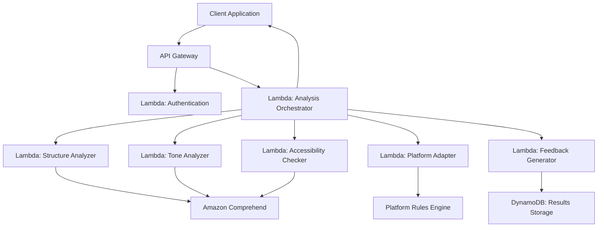

# Design Document: AI-Powered Content Quality Reviewer

## Overview

The AI-powered Content Quality Reviewer is a serverless system built on AWS that analyzes digital content across multiple quality dimensions and provides actionable feedback to student creators. The system leverages AWS managed services including Lambda, Comprehend, and API Gateway to deliver scalable, cost-effective content analysis without requiring server management.

The system follows a microservices architecture where each quality dimension is analyzed by specialized components, enabling independent scaling and maintenance. The design emphasizes explainability, responsible AI use, and preservation of the creator's original voice while providing constructive feedback.

## Architecture

The system uses a serverless, event-driven architecture built on AWS services:



**Key Architectural Principles:**
- **Serverless-first**: All compute runs on AWS Lambda for automatic scaling and cost optimization
- **Event-driven**: Components communicate through events and API calls
- **Separation of concerns**: Each analyzer handles a specific quality dimension
- **Managed services**: Leverages AWS Comprehend for NLP capabilities
- **Stateless design**: Each request is independent, enabling horizontal scaling

## Components and Interfaces

### API Gateway
**Purpose**: Provides RESTful API endpoints and handles request routing, authentication, and rate limiting.

**Endpoints**:
- `POST /analyze` - Submit content for quality analysis
- `GET /analysis/{id}` - Retrieve analysis results
- `GET /health` - System health check

**Input Schema**:
```json
{
  "content": "string (required, max 2000 words)",
  "targetPlatform": "blog | linkedin | twitter | medium",
  "contentIntent": "inform | educate | persuade",
  "userId": "string (optional for tracking)"
}
```

### Analysis Orchestrator (Lambda)
**Purpose**: Coordinates the analysis workflow by distributing content to specialized analyzers and aggregating results.

**Responsibilities**:
- Input validation and sanitization
- Parallel invocation of analyzer components
- Result aggregation and scoring normalization
- Error handling and retry logic

**Interface**:
```typescript
interface AnalysisRequest {
  content: string;
  targetPlatform: Platform;
  contentIntent: Intent;
  userId?: string;
}

interface AnalysisResult {
  overallScore: number;
  dimensionScores: DimensionScores;
  feedback: Suggestion[];
  analysisId: string;
  timestamp: string;
}
```

### Structure Analyzer (Lambda)
**Purpose**: Evaluates content organization, logical flow, and structural clarity.

**Analysis Criteria**:
- Paragraph structure and transitions
- Logical argument progression
- Introduction and conclusion presence
- Heading hierarchy and organization

**AWS Comprehend Integration**:
- Key phrase extraction for topic identification
- Syntax analysis for sentence structure evaluation

### Tone Analyzer (Lambda)
**Purpose**: Assesses content tone and emotional characteristics using sentiment analysis and linguistic patterns.

**Analysis Criteria**:
- Sentiment polarity and intensity
- Formality level assessment
- Emotional tone consistency
- Voice authenticity indicators

**AWS Comprehend Integration**:
- Sentiment analysis API for emotional tone
- Entity recognition for context understanding

### Accessibility Checker (Lambda)
**Purpose**: Evaluates content for inclusiveness, readability, and accessibility compliance.

**Analysis Criteria**:
- Flesch-Kincaid readability scores
- Inclusive language assessment
- Technical jargon identification
- Sentence complexity analysis

**Implementation**:
- Custom readability algorithms (Flesch-Kincaid, Gunning Fog)
- Bias detection using predefined word lists
- Complexity scoring based on sentence structure

### Platform Adapter (Lambda)
**Purpose**: Applies platform-specific evaluation criteria and best practices.

**Platform Rules Engine**:
- LinkedIn: Professional tone, networking focus, industry relevance
- Blog: Depth, engagement potential, SEO considerations
- Twitter: Conciseness, hashtag usage, engagement hooks
- Medium: Storytelling, depth, reader engagement

**Configuration**:
```json
{
  "linkedin": {
    "preferredTone": "professional",
    "maxLength": 1300,
    "requiredElements": ["call-to-action", "professional-context"]
  },
  "blog": {
    "preferredTone": "conversational",
    "minLength": 300,
    "requiredElements": ["introduction", "conclusion"]
  }
}
```

### Feedback Generator (Lambda)
**Purpose**: Creates actionable improvement suggestions based on analysis results while preserving creator intent.

**Suggestion Categories**:
- **Critical**: Issues that significantly impact content effectiveness
- **Important**: Improvements that enhance quality
- **Optional**: Minor enhancements for polish

**Feedback Principles**:
- Specific and actionable recommendations
- Explanation of reasoning behind suggestions
- Preservation of creator's voice and intent
- Prioritization by impact on overall quality

## Data Models

### Content Analysis Request
```typescript
interface ContentAnalysisRequest {
  content: string;
  targetPlatform: 'blog' | 'linkedin' | 'twitter' | 'medium';
  contentIntent: 'inform' | 'educate' | 'persuade';
  userId?: string;
  requestId: string;
  timestamp: Date;
}
```

### Quality Dimension Scores
```typescript
interface DimensionScores {
  structure: QualityScore;
  tone: QualityScore;
  accessibility: QualityScore;
  platformAlignment: QualityScore;
}

interface QualityScore {
  score: number; // 0-100
  confidence: number; // 0-1
  issues: Issue[];
  strengths: string[];
}
```

### Analysis Issue
```typescript
interface Issue {
  type: 'critical' | 'important' | 'minor';
  category: 'structure' | 'tone' | 'accessibility' | 'platform';
  description: string;
  location?: TextLocation;
  suggestion: string;
  reasoning: string;
}

interface TextLocation {
  startIndex: number;
  endIndex: number;
  paragraph?: number;
  sentence?: number;
}
```

### Improvement Suggestion
```typescript
interface Suggestion {
  priority: 'high' | 'medium' | 'low';
  category: string;
  title: string;
  description: string;
  reasoning: string;
  examples?: string[];
  affectedText?: TextLocation[];
}
```

### Analysis Result
```typescript
interface AnalysisResult {
  analysisId: string;
  userId?: string;
  timestamp: Date;
  overallScore: number;
  dimensionScores: DimensionScores;
  suggestions: Suggestion[];
  metadata: {
    processingTime: number;
    contentLength: number;
    platformOptimized: boolean;
  };
}
```

## Correctness Properties

*A property is a characteristic or behavior that should hold true across all valid executions of a system—essentially, a formal statement about what the system should do. Properties serve as the bridge between human-readable specifications and machine-verifiable correctness guarantees.*

### Property 1: Complete Quality Analysis
*For any* valid content input, the Content_Quality_Reviewer should analyze it across all quality dimensions (structure, tone, accessibility, platform alignment) and generate scores within the 0-100 range for each dimension.
**Validates: Requirements 1.1, 1.4, 6.1, 6.4**

### Property 2: Structure Analysis Consistency
*For any* content input, the Structure Analyzer should evaluate structural clarity and logical flow, producing consistent scores for content with similar structural characteristics.
**Validates: Requirements 1.2**

### Property 3: Readability Calculation Accuracy
*For any* content input, the Accessibility Checker should calculate readability scores using standard metrics (Flesch-Kincaid, Gunning Fog) that correlate with known complexity levels.
**Validates: Requirements 1.3, 4.1, 4.4**

### Property 4: Platform-Specific Evaluation Differences
*For any* content analyzed for different target platforms, the Platform Adapter should produce different evaluation results that reflect platform-specific criteria and norms.
**Validates: Requirements 2.1, 2.2, 2.3, 2.4**

### Property 5: Platform Support Validation
*For any* supported platform type (blog, LinkedIn), the Platform Adapter should accept it as valid input and apply appropriate evaluation criteria.
**Validates: Requirements 2.5**

### Property 6: Intent-Based Analysis Variation
*For any* content analyzed with different content intents (inform, educate, persuade), the Content Analyzer should apply different evaluation criteria and produce varying results based on the specified intent.
**Validates: Requirements 3.1, 3.2, 3.3, 3.4**

### Property 7: Input Validation Enforcement
*For any* invalid content intent value, the Content_Quality_Reviewer should reject the input and provide valid intent options.
**Validates: Requirements 3.5**

### Property 8: Bias Detection Accuracy
*For any* content containing potentially exclusive or biased language, the Accessibility Checker should identify and flag the specific problematic phrases with appropriate issue reports.
**Validates: Requirements 4.2, 4.3**

### Property 9: Jargon Detection and Suggestions
*For any* content containing technical jargon, the Accessibility Checker should detect the complex terms and generate appropriate simplification suggestions.
**Validates: Requirements 4.5**

### Property 10: Comprehensive Feedback Generation
*For any* identified quality issues, the Feedback Generator should create specific improvement suggestions with explanatory reasoning, prioritized by impact on overall content quality.
**Validates: Requirements 5.1, 5.3, 5.4**

### Property 11: Structured Result Organization
*For any* analysis result, the Content_Quality_Reviewer should organize feedback by quality dimension and include clear explanations of what each score means.
**Validates: Requirements 6.2, 6.5**

### Property 12: Low Score Priority Highlighting
*For any* quality dimension scores below acceptable thresholds, the Content_Quality_Reviewer should highlight those areas as priority improvement targets.
**Validates: Requirements 6.3**

### Property 13: Progress Reporting Consistency
*For any* analysis request in progress, the Content_Quality_Reviewer should provide progress indicators that accurately reflect the current processing state.
**Validates: Requirements 8.4**

### Property 14: Request Logging Completeness
*For any* analysis request processed by the system, the Content_Quality_Reviewer should generate appropriate log entries for monitoring and improvement purposes.
**Validates: Requirements 8.5**

## Error Handling

The system implements comprehensive error handling across all components:

### Input Validation Errors
- **Empty Content**: Returns HTTP 400 with message "Content cannot be empty"
- **Content Too Long**: Returns HTTP 400 with message "Content exceeds 2000 word limit"
- **Invalid Platform**: Returns HTTP 400 with list of supported platforms
- **Invalid Intent**: Returns HTTP 400 with list of supported intents

### Service Integration Errors
- **AWS Comprehend Failures**: Graceful degradation with reduced analysis scope
- **Timeout Handling**: 30-second timeout with partial results if available
- **Rate Limiting**: HTTP 429 with retry-after headers

### System Errors
- **Lambda Function Failures**: Automatic retry with exponential backoff
- **DynamoDB Errors**: Fallback to in-memory result storage
- **Network Issues**: Circuit breaker pattern for external service calls

### Error Response Format
```json
{
  "error": {
    "code": "INVALID_INPUT",
    "message": "Content cannot be empty",
    "details": {
      "field": "content",
      "expectedFormat": "Non-empty string up to 2000 words"
    }
  }
}
```

## Testing Strategy

The system employs a dual testing approach combining unit tests for specific scenarios and property-based tests for comprehensive coverage:

### Unit Testing Approach
Unit tests focus on:
- **Specific examples**: Known content samples with expected analysis results
- **Edge cases**: Empty content, maximum length content, special characters
- **Error conditions**: Invalid inputs, service failures, timeout scenarios
- **Integration points**: API Gateway routing, Lambda function orchestration

### Property-Based Testing Approach
Property-based tests validate universal properties using **fast-check** (JavaScript/TypeScript property testing library):
- **Minimum 100 iterations** per property test for statistical confidence
- **Random content generation** with varying lengths, structures, and complexity
- **Platform and intent combinations** to test all evaluation paths
- **Score consistency validation** across similar content types

### Property Test Configuration
Each property test includes:
- **Tag format**: `Feature: content-quality-reviewer, Property {number}: {property_text}`
- **Custom generators** for realistic content, platforms, and intents
- **Assertion helpers** for score validation and result structure verification
- **Shrinking strategies** to find minimal failing examples

### Test Coverage Requirements
- **Unit tests**: 90% code coverage for business logic
- **Property tests**: All 14 correctness properties implemented
- **Integration tests**: End-to-end API workflows
- **Performance tests**: Response time validation under load

### Example Property Test Structure
```typescript
// Feature: content-quality-reviewer, Property 1: Complete Quality Analysis
fc.assert(fc.property(
  contentGenerator(), // Generates realistic content samples
  platformGenerator(), // Generates valid platform types
  intentGenerator(),   // Generates valid intent types
  async (content, platform, intent) => {
    const result = await analyzeContent({ content, platform, intent });
    
    // Verify all dimensions have scores in valid range
    expect(result.dimensionScores.structure.score).toBeInRange(0, 100);
    expect(result.dimensionScores.tone.score).toBeInRange(0, 100);
    expect(result.dimensionScores.accessibility.score).toBeInRange(0, 100);
    expect(result.dimensionScores.platformAlignment.score).toBeInRange(0, 100);
  }
), { numRuns: 100 });
```

This comprehensive testing strategy ensures both concrete correctness (unit tests) and universal properties (property tests) are validated, providing confidence in system reliability and correctness across all possible inputs.